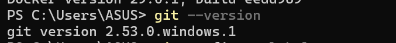
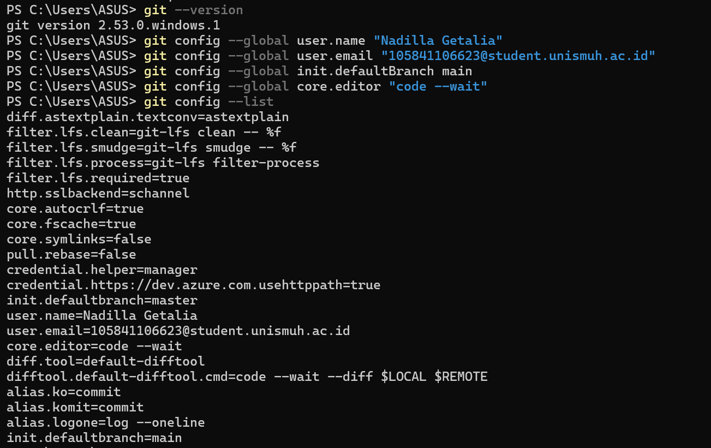
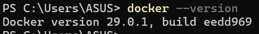
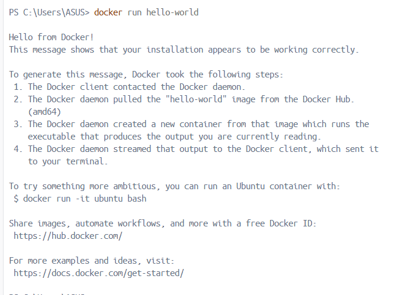
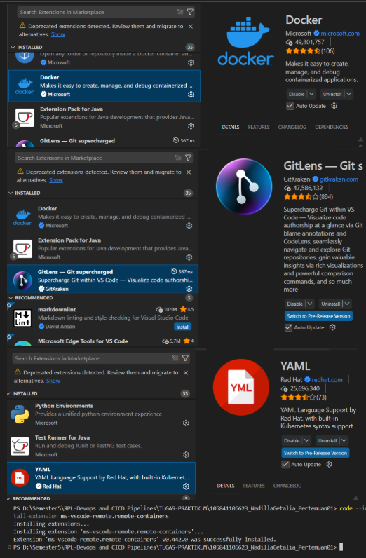

# 📋 Laporan Praktikum Pertemuan 01
## DevOps Culture & Principles

## 👤 Identitas Mahasiswa

| Item | Keterangan |
|------|------------|
| **Nama** | NADILLA GETALIA |
| **NIM** | 105841106623 |
| **Kelas** | 5B |
| **Tanggal** | 2026-02-24 |

---

## 📚 Pemahaman DevOps

### Apa itu DevOps?

DevOps adalah pendekatan dan budaya kerja yang mengintegrasikan tim Development dan Operations untuk menghilangkan sekat (silo) yang sebelumnya sering menimbulkan konflik akibat perbedaan prioritas antara kecepatan pengembangan dan stabilitas sistem. Dengan menekankan kolaborasi, komunikasi, dan otomatisasi proses seperti pengujian serta deployment, DevOps bertujuan memperpendek siklus pengembangan dan memungkinkan pengiriman fitur, perbaikan, serta pembaruan secara berkelanjutan dengan kualitas tinggi. Lebih dari sekadar penggunaan tools, DevOps merupakan perubahan mindset dalam membangun, menguji, dan mendistribusikan produk IT agar lebih cepat, stabil, dan aman.

### Mengapa DevOps penting dalam industri software saat ini?

DevOps menjadi penting di era digital karena perusahaan dituntut untuk menghadirkan inovasi secara cepat tanpa mengorbankan kestabilan sistem. Tanpa penerapan DevOps, proses rilis aplikasi cenderung lebih lambat, kompleks, dan berisiko tinggi terhadap kesalahan manual. Sebagai ilustrasi, ketika sebuah platform e-commerce mengalami lonjakan pengunjung saat momen promo besar seperti Harbolnas, gangguan kecil pada fitur pembayaran dapat berdampak signifikan. Dengan penerapan praktik Continuous Integration dan Continuous Delivery (CI/CD), tim pengembang dapat segera memperbaiki kesalahan, menjalankan pengujian otomatis, dan merilis pembaruan ke lingkungan produksi dalam waktu singkat, sehingga layanan tetap berjalan lancar tanpa mengganggu pengalaman pengguna.

---
## 📸 Screenshot Bukti Instalasi

| No | Screenshot | Keterangan |
|----|------------|------------|
| 1 |  | Output git --version |
| 2 |  | Output git config --list |
| 3 |  | Output docker --version |
| 4 |  | Output docker run hello-world |
| 5 | | VS Code dengan extensions |
---

## 💭 Refleksi Pribadi

### Harapan dari Praktikum Ini

Harapan saya adalah mendapatkan pemahaman praktis mengenai bagaimana siklus pengembangan perangkat lunak di industri modern berjalan, serta terbiasa menggunakan tools standar industri.

### Skill yang Ingin Dikuasai

Saya ingin menguasai otomatisasi CI/CD pipelines, mahir menggunakan Git untuk kolaborasi tingkat lanjut (branching strategies), serta memahami dasar-dasar containerization menggunakan Docker.

---
*Laporan ini dibuat pada Selasa, 24 Februari 2026*