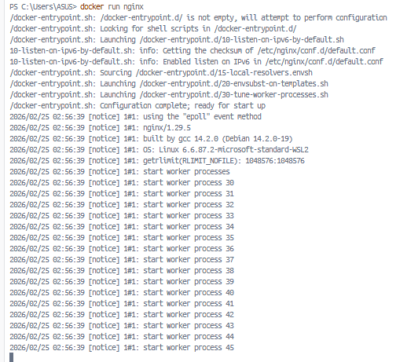
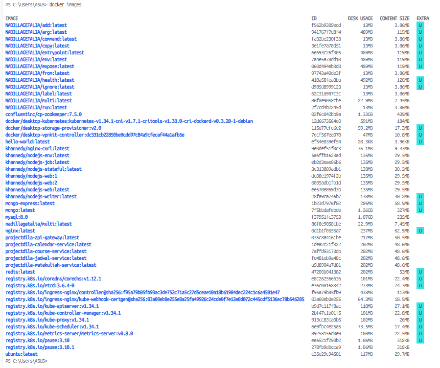
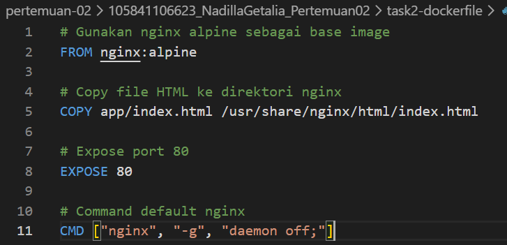
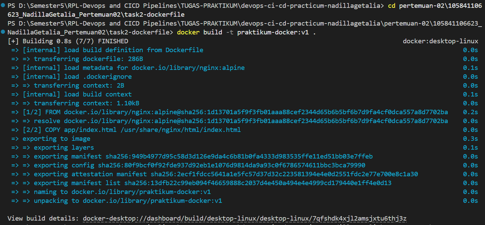
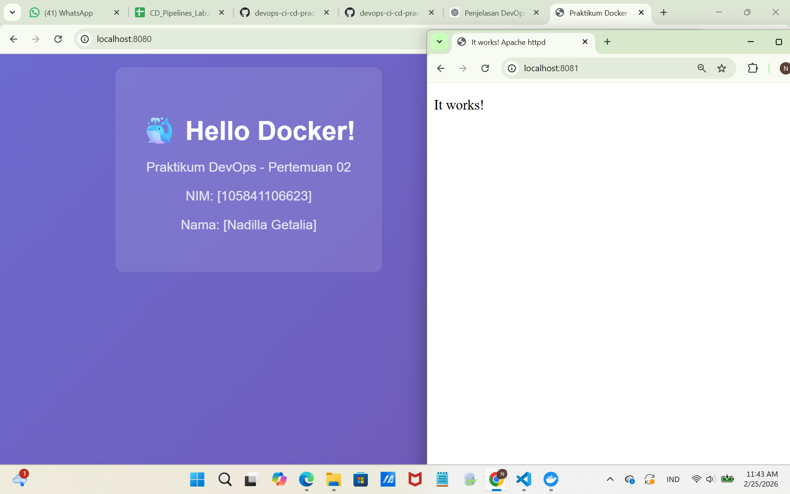
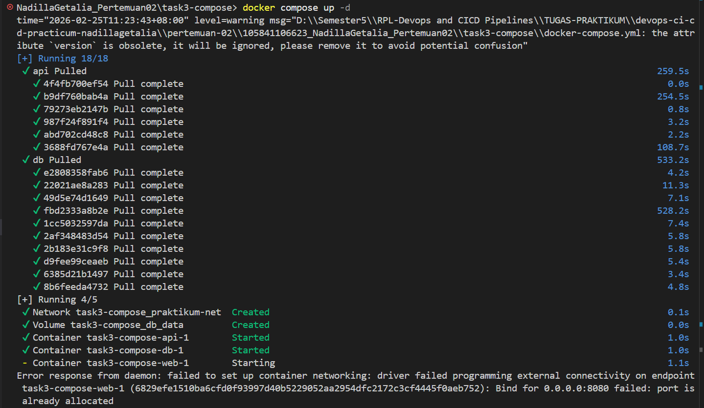

# 🐳 Laporan Praktikum Pertemuan 02
## Docker Fundamentals

---

## 👤 Identitas Mahasiswa

| Item | Keterangan |
|------|------------|
| **Nama** | Nadilla Getalia |
| **NIM** | 105841106623 |
| **Kelas** | 5B |
| **Tanggal** | 2026-02-25 |

---

## 📚 Pemahaman Docker

### Apa itu Docker?

Docker adalah platform containerization yang digunakan untuk mengemas aplikasi beserta seluruh dependensi, library, dan konfigurasi yang dibutuhkan ke dalam sebuah container sehingga dapat dijalankan secara konsisten di berbagai lingkungan, baik di komputer pengembang maupun server produksi.

1. Container adalah lingkungan terisolasi untuk menjalankan aplikasi beserta dependensinya dalam satu paket ringan dan dapat berjalan konsisten di berbagai sistem.

2. Image adalah template atau blueprint yang digunakan untuk membuat container; image bersifat statis, sedangkan container adalah versi yang sedang berjalan.

3. Perbedaannya dengan VM, container lebih ringan karena berbagi kernel dengan sistem host, sedangkan Virtual Machine (VM) menjalankan sistem operasi sendiri sehingga lebih berat dan membutuhkan sumber daya lebih besar.

### Komponen Utama Docker

1. Images
Docker Image adalah template atau blueprint yang berisi kode aplikasi, library, dependensi, dan konfigurasi yang dibutuhkan untuk menjalankan aplikasi. Image bersifat read-only dan menjadi dasar untuk membuat container.

2. Containers
Container adalah instance yang berjalan dari sebuah image. Container menjalankan aplikasi dalam lingkungan terisolasi, ringan, dan konsisten di berbagai sistem.

3. Registry
Registry adalah tempat penyimpanan dan distribusi Docker image. Registry bisa bersifat publik seperti Docker Hub atau privat, sehingga memudahkan developer untuk menyimpan, berbagi, dan mengunduh image.

### Perbedaan Docker vs Virtual Machine

Container lebih ringan dan cepat untuk deployment aplikasi, sedangkan VM memberikan isolasi penuh karena masing-masing memiliki OS sendiri, tetapi lebih boros resource.

---

## 🔧 Praktik Docker Commands

### Output docker ps -a

```
CONTAINER ID   IMAGE                       COMMAND                   CREATED          STATUS                     PORTS                      NAMES
9b637828e708   0d1b1f0656a7                "/docker-entrypoint.…"    14 seconds ago   Up 13 seconds                                         k8s_nginx_nginx_default_79c65ac9-7d92-44be-a843-df62190b68da_2
d6d87797d901   28fa9ca746b7                "docker-entrypoint.s…"    17 seconds ago   Up 16 seconds                                         k8s_nodejs-writer_nodejs-writer_default_b97e6548-bc1a-4573-8c61-92783b330d3b_2
f790ec62637d   hello-world                 "/hello"                  6 hours ago      Exited (0) 6 hours ago                                friendly_burnell
8e7a8661a18a   hello-world                 "/hello"                  6 hours ago      Exited (0) 6 hours ago                                jolly_kilby
56d9492dc62e   app-golang:1.0.0            "/bin/sh -c 'go run …"    6 weeks ago      Exited (255) 6 weeks ago   0.0.0.0:8080->8080/tcp     app
f90cdc194ad1   NADILLAGETALIA/copy         "/bin/sh -c 'cat \"he…"   7 weeks ago      Exited (0) 7 weeks ago                                copy
6363f31459ce   NADILLAGETALIA/add          "/bin/sh -c 'cat \"he…"   7 weeks ago      Exited (0) 7 weeks ago                                add
e76af84be9f4   NADILLAGETALIA/command      "/bin/sh -c 'cat \"he…"   7 weeks ago      Exited (0) 7 weeks ago                                command
14850dcb8108   mongo-express:latest        "/sbin/tini -- /dock…"    7 weeks ago      Exited (255) 7 weeks ago   0.0.0.0:8081->8081/tcp     mongodbexpress
8e83104217d8   mongo:latest                "docker-entrypoint.s…"    7 weeks ago      Exited (255) 7 weeks ago   27017/tcp                  mongodb
c5b511dc6de3   mongo:latest                "docker-entrypoint.s…"    7 weeks ago      Exited (255) 7 weeks ago   0.0.0.0:27019->27017/tcp   mongovolume
4ee6eb5829a9   mongo:latest                "docker-entrypoint.s…"    7 weeks ago      Exited (255) 7 weeks ago   0.0.0.0:27018->27017/tcp   mongodata
2548731fa7f0   ca871a86d45a                "/docker-entrypoint.…"    7 weeks ago      Exited (255) 7 weeks ago   0.0.0.0:8081->80/tcp       smallnginx
ba8adad659c1   mongo:latest                "docker-entrypoint.s…"    7 weeks ago      Exited (255) 7 weeks ago   0.0.0.0:27017->27017/tcp   contohmongo
8f2d7afab002   ca871a86d45a                "/docker-entrypoint.…"    7 weeks ago      Exited (255) 7 weeks ago   0.0.0.0:8080->80/tcp       contohnginx
48ccb62a5972   redis:latest                "docker-entrypoint.s…"    7 weeks ago      Exited (255) 7 weeks ago   6379/tcp                   contohredis
```

### Output docker images

```
IMAGE                                                                                                                    ID             DISK USAGE   CONTENT SIZE   EXTRA
NADILLAGETALIA/add:latest                                                                                                f962b9309ecd         13MB         3.86MB    U   
NADILLAGETALIA/arg:latest                                                                                                941767f7d8f4        489MB          119MB    U   
NADILLAGETALIA/command:latest                                                                                            fa32be230f33         13MB         3.86MB    U   
NADILLAGETALIA/copy:latest                                                                                               3e1fe7a78d51         13MB         3.86MB    U   
NADILLAGETALIA/entrypoint:latest                                                                                         6e693c26f306        489MB          119MB    U   
NADILLAGETALIA/env:latest                                                                                                7a4e5a78dd10        489MB          119MB    U   
NADILLAGETALIA/expose:latest                                                                                             060d494eb0d0        489MB          119MB    U   
NADILLAGETALIA/from:latest                                                                                               97743a40de3f         13MB         3.86MB        
NADILLAGETALIA/health:latest                                                                                             418a58fea3ba        492MB          120MB    U   
NADILLAGETALIA/ignore:latest                                                                                             d985d8999123         13MB         3.86MB    U   
NADILLAGETALIA/label:latest                                                                                              62c31a987c3c         13MB         3.86MB        
NADILLAGETALIA/multi:latest                                                                                              86f8e9058cbe       22.9MB         7.45MB        
NADILLAGETALIA/run:latest                                                                                                2f7cd4b2245d         13MB         3.86MB        
NADILLAGETALIA/user:latest                                                                                               87f779a3e3d2        489MB          119MB    U   
NADILLAGETALIA/volume:latest                                                                                             96f607b39178        489MB          119MB    U   
NADILLAGETALIA/workdir:latest                                                                                            43a8f60e9e8d        489MB          119MB    U   
app-golang:1.0.0                                                                                                         39c91d9bdf1c        489MB          119MB    U   
confluentinc/cp-kafka:7.5.0                                                                                              fbbb6fa11b25       1.33GB          439MB        
confluentinc/cp-zookeeper:7.5.0                                                                                          02f6c042bb9a       1.33GB          439MB        
docker/desktop-kubernetes:kubernetes-v1.34.1-cni-v1.7.1-critools-v1.33.0-cri-dockerd-v0.3.20-1-debian                    12d6673564e0        591MB          184MB        
docker/desktop-storage-provisioner:v2.0                                                                                  115d77efe6e2       59.2MB         17.3MB    U   
docker/desktop-vpnkit-controller:dc331cb22850be0cdd97c84a9cfecaf44a1afb6e                                                7ecf567ea070         47MB         10.8MB    U   
hello-world:latest                                                                                                       ef54e839ef54       20.3kB         3.96kB    U   
khannedy/nginx-curl:latest                                                                                               9e0def51f0c3       35.1MB         9.33MB        
khannedy/nodejs-env:latest                                                                                               5a6ffb1623ad        135MB         29.5MB        
khannedy/nodejs-job:latest                                                                                               eb2d3eae06b6        135MB         29.5MB        
khannedy/nodejs-stateful:latest                                                                                          3c313889adb1        138MB         30.2MB        
khannedy/nodejs-web:1                                                                                                    dc08e1974f2b        135MB         29.5MB        
khannedy/nodejs-web:2                                                                                                    6005adb1fb1d        135MB         29.5MB        
khannedy/nodejs-web:latest                                                                                               ee570e869d3b        135MB         29.5MB        
khannedy/nodejs-writer:latest                                                                                            28fa9ca746b7        138MB         30.2MB    U   
mongo-express:latest                                                                                                     1b23d7976f02        286MB         58.9MB    U   
mongo:latest                                                                                                             7f5bbdafebde       1.26GB          327MB    U   
mysql:8.0                                                                                                                f37951fc3753       1.07GB          235MB        
nadillagetalia/multi:latest                                                                                              86f8e9058cbe       22.9MB         7.45MB        
nginx:latest                                                                                                             0d1b1f0656a7        237MB         62.9MB    U   
projectdila-api-gateway:latest                                                                                           035c8a4161be        217MB         50.5MB        
projectdila-calendar-service:latest                                                                                      1dea2c21f322        202MB         48.6MB        
projectdila-course-service:latest                                                                                        7affd93173db        202MB         48.6MB        
projectdila-jadwal-service:latest                                                                                        fe481eb9a48c        202MB         48.6MB        
projectdila-matakuliah-service:latest                                                                                    a5d8904a7d81        202MB         48.6MB        
redis:latest                                                                                                             47200b041382        202MB           53MB    U   
registry.k8s.io/coredns/coredns:v1.12.1                                                                                  e8c262566636        101MB         22.4MB    U   
registry.k8s.io/etcd:3.6.4-0                                                                                             e36c08168342        273MB         74.3MB    U   
registry.k8s.io/ingress-nginx/controller@sha256:f95a79b85fb93ac3de752c71a5c27d5ceae10a18b61904dec224c1c6a4581e47         f95a79b85fb9        438MB          113MB        
registry.k8s.io/ingress-nginx/kube-webhook-certgen@sha256:03a00eb0e255e8a25fa49926c24cde0f7e12e8d072c445cdf5136ec78b5…   03a00eb0e255       64.3MB         18.9MB        
registry.k8s.io/kube-apiserver:v1.34.1                                                                                   b9d7c117f8ac        118MB         27.1MB    U   
registry.k8s.io/kube-controller-manager:v1.34.1                                                                          2bf47c1b01f5        101MB         22.8MB    U   
registry.k8s.io/kube-proxy:v1.34.1                                                                                       913cc83ca0b5        102MB           26MB    U   
registry.k8s.io/kube-scheduler:v1.34.1                                                                                   6e9fbc4e25a5       73.5MB         17.4MB    U   
registry.k8s.io/metrics-server/metrics-server:v0.8.0                                                                     89258156d0e9        108MB         22.5MB    U   
registry.k8s.io/pause:3.10                                                                                               ee6521f290b2       1.06MB          318kB    U   
registry.k8s.io/pause:3.10.1                                                                                             278fb9dbcca9       1.06MB          318kB        
ubuntu:latest                                                                                                            c35e29c94501        117MB         29.7MB        
```

### Docker Run Command

```bash
docker run -d -p 8080:80 --name praktikum-web praktikum-docker:v1
```

---

## 📄 Dockerfile

### Isi Dockerfile

```dockerfile
# Gunakan nginx alpine sebagai base image
FROM nginx:alpine

# Copy file HTML ke direktori nginx
COPY app/index.html /usr/share/nginx/html/index.html

# Expose port 80
EXPOSE 80

# Command default nginx
CMD ["nginx", "-g", "daemon off;"]
```

### Penjelasan Dockerfile

FROM nginx:alpine - Artinya kita memakai image nginx versi ringan (alpine) sebagai dasar. Jadi container ini nantinya akan menjalankan web server Nginx.

COPY app/index.html /usr/share/nginx/html/index.html - Baris ini menyalin file index.html dari folder app di project kita ke folder bawaan Nginx di dalam container. Folder /usr/share/nginx/html/ adalah tempat Nginx membaca file website.

EXPOSE 80 - Ini memberi tahu bahwa container akan menggunakan port 80 (port standar untuk web).

CMD ["nginx", "-g", "daemon off;"] - Perintah ini menjalankan Nginx saat container mulai. daemon off; artinya Nginx berjalan di foreground supaya container tidak langsung berhenti.

---

## 🐙 Docker Compose

### Isi docker-compose.yml

```yaml
version: '3.8'

services:
  web:
    image: nginx:alpine
    ports:
      - "8080:80"
    volumes:
      - ./app:/usr/share/nginx/html:ro
    depends_on:
      - api
    networks:
      - praktikum-net

  api:
    image: httpd:alpine
    ports:
      - "8081:80"
    networks:
      - praktikum-net

  db:
    image: postgres:15-alpine
    environment:
      POSTGRES_USER: praktikum
      POSTGRES_PASSWORD: devops123
      POSTGRES_DB: praktikum_db
    volumes:
      - db_data:/var/lib/postgresql/data
    networks:
      - praktikum-net

networks:
  praktikum-net:
    driver: bridge

volumes:
  db_data:
```

### Penjelasan Docker Compose

File `docker-compose.yml` ini menggunakan versi 3.8 dan mendefinisikan tiga service yaitu **web**, **api**, dan **db** yang berjalan dalam satu network bernama `praktikum-net` dengan driver bridge agar bisa saling terhubung. Service **web** menggunakan image `nginx:alpine`, membuka port 8080 ke 80, serta menghubungkan folder lokal `./app` ke direktori HTML Nginx dalam mode read-only, dan dibuat bergantung pada service **api** agar dijalankan setelah api siap. Service **api** memakai image `httpd:alpine` dan membuka port 8081 ke 80. Sementara itu, service **db** menggunakan `postgres:15-alpine`, mengatur variabel environment untuk username, password, dan nama database, serta memakai volume bernama `db_data` untuk menyimpan data database agar tetap tersimpan meskipun container dihentikan. Terakhir, bagian `networks` dan `volumes` mendefinisikan jaringan internal dan penyimpanan permanen yang digunakan oleh service-service tersebut.

### Output Docker Compose Up

```
NadillaGetalia_Pertemuan02\task3-compose> docker compose up -d
time="2026-02-25T11:23:43+08:00" level=warning msg="D:\\Semester5\\RPL-Devops and CICD Pipelines\\TUGAS-PRAKTIKUM\\devops-ci-cd-practicum-nadillagetalia\\pertemuan-02\\105841106623_NadillaGetalia_Pertemuan02\\task3-compose\\docker-compose.yml: the attribute `version` is obsolete, it will be ignored, please remove it to avoid potential confusion"
[+] Running 18/18
 ✔ api Pulled                                                                                                          259.5s 
   ✔ 4f4fb700ef54 Pull complete                                                                                          0.0s 
   ✔ b9df760bab4a Pull complete                                                                                        254.5s 
   ✔ 79273eb2147b Pull complete                                                                                          0.8s 
   ✔ 987f24f891f4 Pull complete                                                                                          3.2s 
   ✔ abd702cd48c8 Pull complete                                                                                          2.2s 
   ✔ 3688fd767e4a Pull complete                                                                                        108.7s 
 ✔ db Pulled                                                                                                           533.2s 
   ✔ e2808358fab6 Pull complete                                                                                          4.2s 
   ✔ 22021ae8a283 Pull complete                                                                                         11.3s 
   ✔ 49d5e74d1649 Pull complete                                                                                          7.1s 
   ✔ fbd2333a8b2e Pull complete                                                                                        528.2s 
   ✔ 1cc5032597da Pull complete                                                                                          7.4s 
   ✔ 2af348483d54 Pull complete                                                                                          5.8s 
   ✔ 2b183e31c9f8 Pull complete                                                                                          5.8s 
   ✔ d9fee99ceaeb Pull complete                                                                                          5.4s 
   ✔ 6385d21b1497 Pull complete                                                                                          3.4s 
   ✔ 8b6feeda4732 Pull complete                                                                                          4.8s 
[+] Running 4/5
 ✔ Network task3-compose_praktikum-net  Created                                                                          0.1s 
 ✔ Volume task3-compose_db_data         Created                                                                          0.0s 
 ✔ Container task3-compose-api-1        Started                                                                          1.0s 
 ✔ Container task3-compose-db-1         Started                                                                          1.0s 
 - Container task3-compose-web-1        Starting                                                                         1.1s 
Error response from daemon: failed to set up container networking: driver failed programming external connectivity on endpoint task3-compose-web-1 (6829efe1510ba6cfd0f93997d40b5229052aa2954dfc2172c3cf4445f0aeb752): Bind for 0.0.0.0:8080 failed: port is already allocated
```

---

## 📸 Screenshots

| No | Screenshot | Keterangan |
|----|------------|------------|
| 1 |  | Container yang sedang berjalan |
| 2 |  | Daftar Docker images |
| 3 |  | Isi file Dockerfile |
| 4 |  | Proses docker build |
| 5 |  | Aplikasi berjalan di browser |
| 6 |  | Docker Compose up |

---

## 💭 Refleksi & Kesimpulan

### Yang Dipelajari

Saya belajar bagaimana mengemas sebuah aplikasi (beserta seluruh dependensinya) ke dalam sebuah container menggunakan Dockerfile. Saya juga mempelajari cara menjalankan multi-konfigurasi dengan mudah menggunakan docker-compose.yml, sehingga proses setup environment menjadi sangat cepat dan seragam.

### Manfaat Docker

Berdasarkan yang saya pelajari, Docker membantu pengembangan software dengan membuat aplikasi dan semua dependensinya bisa dikemas dalam satu container sehingga bisa dijalankan di mana saja tanpa masalah perbedaan environment. Dengan Docker Compose, kita juga bisa menjalankan beberapa layanan sekaligus dengan mudah, jadi proses setup jadi lebih cepat, rapi, dan sama untuk semua orang dalam tim.

### Tantangan dan Solusi

Dalam penggunaan Docker, salah satu tantangan yang sering dihadapi adalah error konfigurasi seperti kesalahan pada Dockerfile, port yang bentrok, atau container tidak bisa saling terhubung. Selain itu, pemahaman tentang konsep image, container, dan network juga bisa membingungkan di awal. Solusinya adalah memastikan struktur file sudah benar, mengecek log dengan `docker logs`, menggunakan `docker ps` untuk melihat container yang berjalan, serta memahami konfigurasi melalui Docker Compose agar multi-service dapat terhubung dengan baik. Dengan latihan dan memahami dasar konsepnya, tantangan tersebut bisa diatasi secara bertahap.

---

## ✅ Checklist

- [x] Berhasil membuat Dockerfile yang valid
- [x] Berhasil build Docker image
- [x] Container berjalan dan aplikasi bisa diakses
- [x] Docker Compose berhasil dijalankan
- [x] Semua screenshot lengkap dan jelas
- [x] Penjelasan ditulis dengan bahasa sendiri

---

*Laporan ini dibuat pada Rabu, 25 Februari 2026*